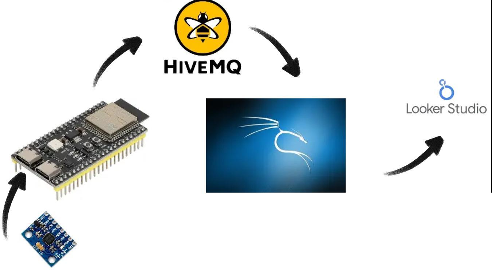
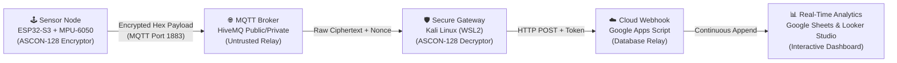
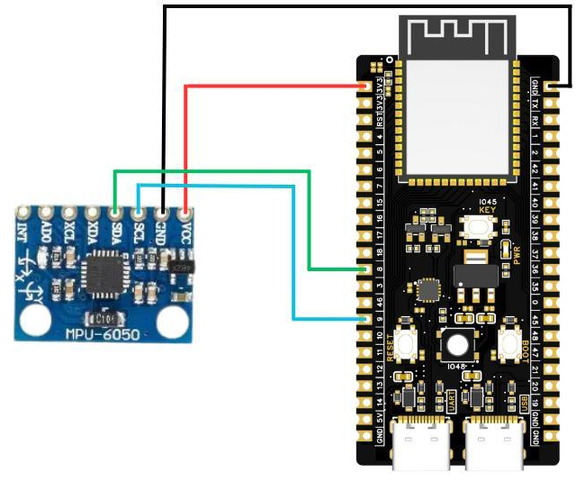
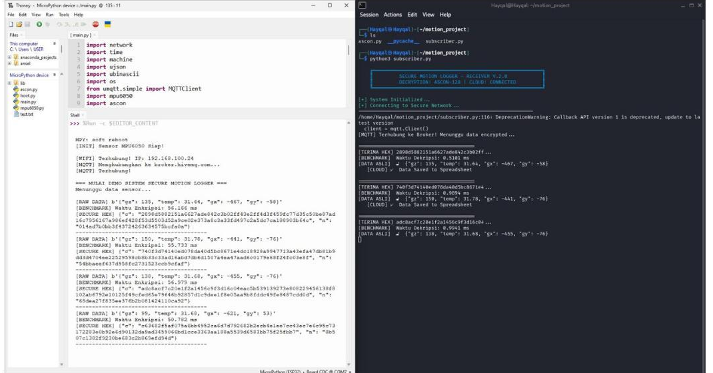
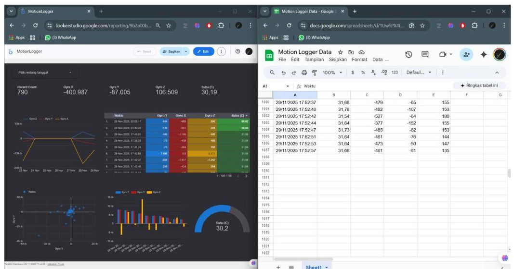
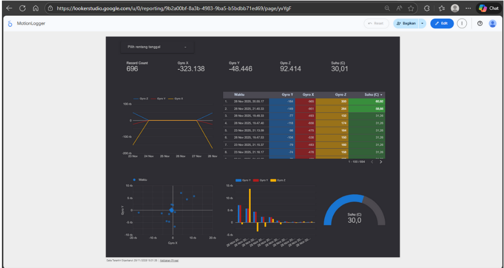

# 🔒 Secure Motion Logger IoT — ASCON-128 Cryptography on ESP32-S3 & Kali Linux

<p align="center">
  
</p>

<p align="center">
  
  
  
  
  
  
  
</p>

---

## 📌 Executive Summary

Modern Internet of Things (IoT) edge sensors frequently broadcast telemetry in unencrypted plaintext, exposing sensitive environmental and operational data to network eavesdropping (*man-in-the-middle*) and malicious payload tampering. Standard enterprise cryptographic algorithms (such as RSA or high-round AES-256) impose prohibitive computational and memory overhead on constrained microcontrollers.

**Secure Motion Logger** resolves this vulnerability by implementing **ASCON-128** — the premier cipher selected by NIST for **Lightweight Cryptography (LWC)** standardisation. The system collects 6-DoF inertial motion and ambient temperature telemetry via an **MPU-6050** sensor, performs on-chip authenticated encryption with associated data (AEAD) in **MicroPython** on an **ESP32-S3**, transmits ciphertexts through a public **HiveMQ MQTT broker**, decrypts and authenticates payloads on a **Kali Linux Secure Gateway**, and streams verified live telemetry to an interactive **Google Looker Studio** dashboard.

---

## 🏛️ System Architecture

The architecture employs a **Distributed IoT Security Topology** composed of four decoupled layers:



1. **Edge Node (`ESP32-S3 DevKitC-1 N16R8`)**: Reads 3-axis angular velocity ($Gy_X, Gy_Y, Gy_Z$) and temperature from MPU-6050 via Software I2C. Benchmarks encryption latency, generates a unique 16-byte nonce, encrypts payload via ASCON-128, and publishes ciphertext + authentication tag over MQTT.
2. **Untrusted Transit Layer (`HiveMQ MQTT`)**: Transports serialized hex packages. Because payloads are encrypted end-to-end with AEAD, broker compromise yields zero plaintext exposure.
3. **Secure Gateway (`Kali Linux`)**: Subscribes to MQTT traffic, extracts the ciphertext and nonce, benchmarks decryption performance, executes authenticated decryption, validates the 128-bit authentication tag, and drops tampered packets.
4. **Cloud Analytics (`Google Sheets & Looker Studio`)**: Authenticated gateway posts verified telemetry via an API token to Google Apps Script, instantly populating real-time time-series charts, scatter plots, and telemetry gauge monitors.

---

## 🔌 Hardware Setup & Wiring

The hardware configuration connects the **ESP32-S3 DevKitC-1 (N16R8)** with the **MPU-6050 6-DoF sensor** via **Software I2C (`SoftI2C`)** at 100 kHz. Software bit-banging guarantees reliable bus arbitration and bypasses hardware I2C silicon quirks on specific MicroPython builds.

<p align="center">
  
</p>

### Pin Assignment Table

| MPU-6050 Pin | ESP32-S3 Pin | Function | Description |
|:---|:---|:---|:---|
| **VCC** | **3V3** | Power Supply | 3.3V DC operational power |
| **GND** | **GND** | Ground | Common reference ground |
| **SCL** | **GPIO 9** | SoftI2C Clock | Serial Clock Line (100 kHz bus clock) |
| **SDA** | **GPIO 8** | SoftI2C Data | Serial Data Line (Bi-directional telemetry) |

---

## 🛡️ Cryptographic Implementation: NIST ASCON-128 AEAD

The core security layer uses **ASCON-128**, an Authenticated Encryption with Associated Data (AEAD) algorithm operating on a 320-bit permutation state:

$$S = [S_0, S_1, S_2, S_3, S_4] \quad \text{where each } S_i \in \mathbb{F}_{2}^{64}$$

```
                +-------------------------------------------------+
Key (128-bit)   |                                                 |
Nonce (128-bit) |-----> [ ASCON-128 Initialization ]              |
                |                     |                           |
AAD ("sensor_auth")                   v                           |
                |-----> [ Process Associated Data ]               |
                |                     |                           |
Plaintext JSON  |                     v                           |
                |-----> [ Process Plaintext / Ciphertext ]        |
                |                     |                           |
                |                     v                           |
                |-----> [ Finalization & Tag Generation ] --------+---> Ciphertext + Tag (128-bit)
```

### Full CIA Triad Verification

* **Confidentiality**: Telemetry (`{"gx": -467, "gy": -58, "gz": 135, "temp": 31.64}`) is transformed into high-entropy hex ciphertext. Eavesdroppers intercepting MQTT traffic cannot infer motion or temperature values.
* **Integrity**: Every encrypted packet carries a 128-bit authentication tag calculated over the state, ciphertext, and authenticated data (`sensor_auth`). Any 1-bit transmission error or payload tampering causes instant tag mismatch.
* **Authentication**: The shared 128-bit key (`rahasia_proyek16`) ensures only verified edge devices can generate accepted telemetry. Spoofed packets injected into the public broker are immediately rejected (`ascon_decrypt` returns `None`).

---

## ⚡ Performance Benchmarks: Edge vs. Gateway

Empirical benchmarking was executed over 50 consecutive telemetry transmission cycles under live WiFi conditions:

<p align="center">
  
</p>

### Empirical Performance Comparison

| Metric / Parameter | Sensor Node (Publisher) | Secure Gateway (Subscriber) |
|:---|:---|:---|
| **Hardware Platform** | ESP32-S3 DevKitC-1 (N16R8) | Host Machine (Kali Linux / WSL2) |
| **Processor Architecture** | Xtensa® 32-bit LX7 Dual-Core | x86_64 Architecture (Intel/AMD) |
| **Clock Frequency** | 240 MHz | Multi-GHz (> 2.5 GHz) |
| **Runtime Environment** | MicroPython v1.26 (Interpreted) | Python 3.11+ (Standard CPython) |
| **Cryptographic Task** | ASCON-128 AEAD Encryption | ASCON-128 AEAD Decryption & Tag Verify |
| **Minimum Latency** | **54.67 ms** | **0.47 ms** |
| **Maximum Latency** | **58.03 ms** | **1.97 ms** |
| **Average Latency** | **55.76 ms** | **0.89 ms** |
| **CPU Cycle Overhead** | **~2.78%** (based on 2.0s loop cycle) | **< 0.05%** (> 1,000 decryptions/sec) |

> 💡 **Key Takeaway**: At 55.76 ms on an interpreted MicroPython runtime, ASCON-128 introduces negligible computational load on the microcontroller. With a 2-second sampling interval, the ESP32-S3 spends over 97% of its cycle in idle, allowing significant battery preservation for remote field deployments.

---

## 📊 Live Cloud Pipeline & Looker Studio Analytics

Once telemetry is decrypted and validated on Kali Linux, it is uploaded to Google Sheets via an authenticated Google Apps Script Webhook and visualized live on **Google Looker Studio**.

<p align="center">
  
</p>

<p align="center">
  
</p>

### Dashboard Analytics Breakdown

1. **Executive Top Layer**:
   * **Telemetry Sample Counter**: Total verified data records collected.
   * **Real-Time Scorecards**: Live readings for Gyro X, Gyro Y, Gyro Z, and ambient temperature (°C).
   * **Dynamic Date/Time Filter**: Isolate specific operational windows or historical incident periods.
2. **Trend & Historical Analysis (Middle Layer)**:
   * **Multi-Axis Time Series Chart**: Tracks angular velocity oscillations across 3 axes to identify vibration spikes or movement events.
   * **Heatmap Log Table**: Tabular view with conditional color gradients highlighting extreme motion anomalies.
3. **Distribution & State Analytics (Bottom Layer)**:
   * **2D Motion Scatter Plot**: Maps Gyro X versus Gyro Y correlation clusters.
   * **Multi-Series Column Histogram**: Compares energy distribution across spatial dimensions.
   * **Semi-Circle Gauge Meter**: Instant visual status of ambient thermal safety thresholds.

---

## 📂 Repository Structure

```text
secure-motion-logger-ascon128/
├── firmware/                        # MicroPython Edge Node Source
│   ├── boot.py                      # Clean boot initialization script
│   ├── main.py                      # Main telemetry acquisition & ASCON encryptor loop
│   ├── ascon.py                     # NIST ASCON-128 AEAD cipher implementation
│   ├── mpu6050.py                   # Custom SoftI2C driver for MPU-6050 6-DoF IMU
│   └── lib/
│       └── umqtt/
│           ├── __init__.py
│           └── simple.py            # Lightweight MicroPython MQTT client library
├── gateway/                         # Kali Linux / Linux Secure Gateway
│   ├── subscriber.py                # MQTT consumer, ASCON decryptor, and Cloud webhook forwarder
│   ├── ascon.py                     # Cryptographic engine (identical to edge cipher)
│   └── requirements.txt             # Python dependencies (paho-mqtt, requests)
├── cloud/                           # Cloud Integration
│   └── Code.gs                      # Google Apps Script Webhook endpoint with Token Auth
├── assets/                          # Architecture diagrams, schematics, and UI logs
│   ├── system_architecture.png
│   ├── hardware_wiring.png
│   ├── encryption_decryption_benchmark.png
│   ├── continuous_transmission_log.png
│   ├── cloud_pipeline_looker_sheets.png
│   └── looker_studio_dashboard.png
├── .gitignore                       # Repository ignore rules
├── LICENSE                          # MIT Open Source License
└── README.md                        # Comprehensive system documentation
```

---

## 🚀 Quickstart & Deployment Guide

### 1. Flash MicroPython to ESP32-S3

1. Connect the ESP32-S3 DevKitC-1 to your computer using a USB-C data cable.
2. Open **Thonny IDE** (v4.1.4 or newer).
3. Navigate to **Run** → **Configure Interpreter** → **MicroPython (ESP32)**.
4. Click **Install or update MicroPython**. Select the official firmware variant for Octal SPIRAM:
   ```text
   ESP32_GENERIC_S3-SPIRAM_OCT.bin
   ```
   *(Ensure "Erase flash before installing" is checked).*
5. Upload all files from `firmware/` (`boot.py`, `main.py`, `ascon.py`, `mpu6050.py`, and `lib/umqtt/simple.py`) to the ESP32-S3 flash filesystem.

### 2. Configure & Run ESP32-S3 Firmware

Edit WiFi credentials in `firmware/main.py`:
```python
WIFI_SSID = "YOUR_WIFI_NETWORK"
WIFI_PASS = "YOUR_WIFI_PASSWORD"
```
Run `main.py` directly from Thonny or reset the board to execute automatically.

### 3. Deploy Google Cloud Webhook

1. Create a new **Google Spreadsheet** with column headers:
   `[Waktu, Suhu, Gyro X, Gyro Y, Gyro Z]`.
2. Open **Extensions** → **Apps Script**.
3. Paste the contents of [`cloud/Code.gs`](cloud/Code.gs).
4. Click **Deploy** → **New Deployment**:
   * Select type: **Web App**
   * Execute as: **Me**
   * Who has access: **Anyone**
5. Copy the generated **Web App URL**.

### 4. Run Kali Linux Secure Gateway

In Kali Linux (or WSL2 / Ubuntu):
```bash
# Clone the repository
git clone https://github.com/KyuraNyx/secure-motion-logger-ascon128.git
cd secure-motion-logger-ascon128/gateway

# Install dependencies
pip3 install -r requirements.txt

# Run subscriber gateway with your Google Script URL
export GOOGLE_SCRIPT_URL="https://script.google.com/macros/s/YOUR_SCRIPT_ID/exec"
python3 subscriber.py
```

---

## 👥 Authors & Project Contributors

* **Hayqal Husein Alhabsyi**
* **Muhammad Zaki Firmansyah**
* **Muhammad Raihan Aqeela Akbar**

---

## 📄 License

This project is licensed under the **MIT License** — see the [LICENSE](LICENSE) file for complete details.
